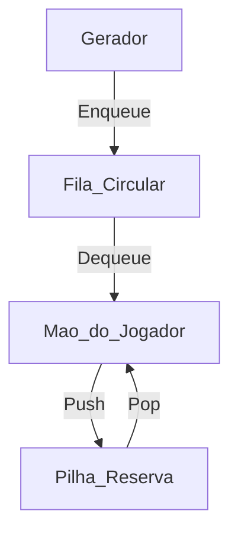

# 🧩 Tetris Stack Challenge - Estrutura de Dados em C


> Um sistema de gerenciamento de peças para jogos inspirado no Tetris, desenvolvido para a empresa fictícia **ByteBros**, utilizando estruturas de dados clássicas como **Filas Circulares** e **Pilhas**.

---

## 💻 Sobre o Projeto

Este projeto foi desenvolvido como parte do desafio da disciplina de **Estrutura de Dados**. O objetivo principal foi criar a lógica de *backend* para um jogo de Tetris, onde o jogador precisa gerenciar peças futuras e uma reserva estratégica.

O sistema simula um cenário real de **Game Dev**, onde a eficiência de memória e a manipulação de ponteiros são cruciais.

### 🎯 Funcionalidades

O desafio foi dividido em três níveis de complexidade:

| Nível | Funcionalidade Implementada | Estrutura Usada |
| :--- | :--- | :--- |
| **Novato** | Fila de "Próximas Peças" com reposição automática | `Fila Circular` (Circular Queue) |
| **Aventureiro** | Sistema de "Reserva" (Hold) de peças | `Pilha Estática` (Stack) |
| **Mestre** | Trocas estratégicas e manipulação direta de memória | Integração `Fila` ↔ `Pilha` |

---

## ⚙️ Arquitetura e Lógica

O projeto utiliza **Structs** para definir as peças e as estruturas de dados. A lógica central gira em torno de ponteiros e índices:

* **Fila Circular:** Utiliza aritmética modular `(fim + 1) % TAM` para criar um buffer infinito de peças futuras.
* **Pilha:** Utiliza o conceito LIFO (Last In, First Out) para a mecânica de reserva.

### Diagrama Conceitual



🚀 Como Executar
Pré-requisitos
* Compilador GCC instalado (MinGW no Windows ou nativo no Linux/Mac).

Passo a passo
1. Clone o repositório:

```Bash

git clone [https://github.com/brulprado/tetris-stack-challenge.git](https://github.com/brulprado/tetris-stack-challenge.git)
```

2. Entre na pasta do projeto:

```Bash

cd tetris-stack-challenge/src
```

3. Compile o código:

```Bash

gcc main.c -o tetris_game
```

4. Execute:

```Bash

# No Windows:
./tetris_game.exe

# No Linux/Mac:
./tetris_game
```

🛠 **Tecnologias Utilizadas**

**C:** Linguagem base para manipulação de memória.

**Structs & Pointers:** Para modelagem de dados complexos.

**Git/GitHub:** Versionamento de código.

👨‍💻 Autor

*Bruna Lima Prado👋*
